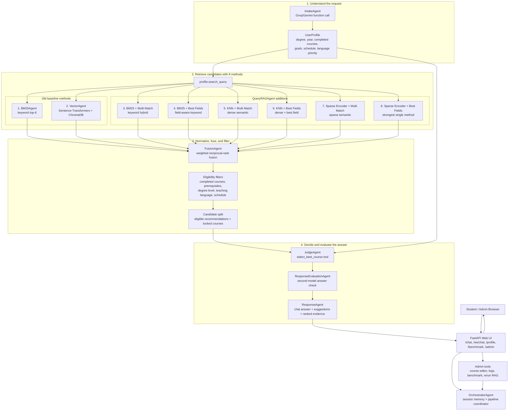

# 🎓 Multi-Agent Course Finder v2
### *Advanced Intelligent Academic Advisor for NCU CSIE*

[](https://python.org)
[](https://fastapi.tiangolo.com)
[](https://trychroma.com)
[](https://groq.com)
[](https://aistudio.google.com)
[](https://pytest.org)

---

## 🌟 Project Overview

**Multi-Agent Course Finder v2** is a state-of-the-art academic advising platform designed for the National Central University (NCU) department of Computer Science and Information Engineering (CSIE). Combining hybrid dense/sparse vector retrieval, an 8-way Query RAG matrix, Reciprocal Rank Fusion (RRF), and a dual-LLM pipeline featuring comparative reasoning and independent QA verification, the platform offers college students a conversational and academically rigorous course selection experience.

---

## 🚀 Key Innovations & What's New in v2

| Feature | v1 (Baseline) | v2 (Current Production) | Benefit |
| :--- | :--- | :--- | :--- |
| **User Input Parsing** | Simple string validation | **IntakeAgent** — LLM function extraction | Extracts structured `UserProfile` and intent from natural language. |
| **Session Memory** | Stateless (single-turn) | **Multi-turn Profile Merging** (`UserProfile.update()`) | Intelligently merges constraints, completed courses, and goals over chat history. |
| **Retrieval Strategies** | BM25 + Vector only | **8-way Hybrid Query RAG** | Combines sparse, dense, best-fields, and multi-match RAG strategies. |
| **Academic Filtering** | None | **Prerequisite & Degree Level Gates** | Filters out courses where requirements aren't met or degree levels are mismatched. |
| **Logical Recommendations** | Returns ranked list only | **JudgeAgent** — Comparative Advisor | Selects the single best match, explicitly reasoning why it is superior to runner-ups. |
| **Response Validation** | None | **ResponseEvaluationAgent** — Independent QA | A secondary model validates factual consistency and prevents hallucinations. |
| **User Interface** | — | **FastAPI Web UI + Interactive Admin Panel** | Modern chatbot UI with active session logging and catalog CRUD controls. |
| **Course Catalogue** | 3 undergrad courses | **70 courses** | Covers CSIE, EE, Comm Engineering, and Math departments. |

---

## 🏛️ System Architecture

The orchestrator coordinates the entire student recommendation pipeline across three primary layers:
1. **Intake & Profile Layer**: Synthesizes natural conversation into a structured user profile.
2. **8-Way Hybrid Retrieval Matrix**: Runs multi-strategy keyword, semantic, and sparse retrieval.
3. **Logic, Fusion & Filtering Layer**: Computes weighted RRF scores and enforces prerequisite constraints.
4. **Advising & Evaluation Layer**: Recommends the optimal course and runs a secondary QA check to guarantee accuracy.



---

## 🤖 The Agent Matrix

| # | Agent Name | Core Role | Technology | LLM Call |
| :-: | :--- | :--- | :--- | :-: |
| **1** | **IntakeAgent** | Converts chat logs into structured `UserProfile` values. | Function Calling | ✅ |
| **2** | **BM25Agent** | Executes fast keyword indexing and retrieval. | BM25Okapi | — |
| **3** | **VectorAgent** | Computes semantic dense vector matches. | ChromaDB / ST | — |
| **4** | **QueryRAGAgent** | Spans 6 additional query-time dense/sparse strategies. | Custom Query RAG | — |
| **5** | **FusionAgent** | Computes weighted RRF rankings and enforces academic filters. | Pure Python | — |
| **6** | **JudgeAgent** | Selects the single best match and provides comparative reasoning. | Function Calling | ✅ |
| **7** | **ResponseAgent** | Formats eligible shortlists, future locked roadmaps, and UI widgets. | Pure Python | — |
| **8** | **ResponseEvaluationAgent** | Performs secondary QA validation to ensure correctness and prevent hallucinations. | Secondary LLM | ✅ |
| **9** | **OrchestratorAgent** | Coordinates conversation state and guides the agent pipeline. | Core Controller | — |

---

## 📊 The 8-Way Hybrid Retrieval Matrix

Our RAG system retrieves candidates through 8 distinct retrieval strategies to ensure both keyword precision and deep semantic coverage:

| Strategy | Algorithmic Approach | Focus |
| :--- | :--- | :--- |
| **BM25Agent** | BM25Okapi scoring | Keyword-level title/description match. |
| **VectorAgent** | Sentence-Transformers + Cosine Similarity | Dense contextual semantics. |
| **BM25 + Multi Match** | Keyword frequency aggregation | Fuses multiple keyword hits across course fields. |
| **BM25 + Best Fields** | Single strongest field match | Prioritizes exact matches in course titles or IDs. |
| **KNN + Multi Match** | Dense semantic query expansion | Matches dense vector representations of all course aspects. |
| **KNN + Best Fields** | Dense semantic target-field match | Prioritizes semantic match against specific, core field aspects. |
| **Sparse Encoder + Multi Match** | Lexical semantic hybrid | Ensures deep vocabulary mapping without losing term precision. |
| **Sparse Encoder + Best Fields** | Robust target-field lexical search | High-precision sparse retrieval focusing on principal target fields. |

---

## 🎓 Academic Gateway & Degree Support

### Degree Level Mapping
Our model automatically derives the student's degree level from their academic year, allowing PhD, Master's, and undergraduate students to get appropriate recommendations:

| Degree Level | `degree_level` | `academic_year` range |
| :--- | :---: | :---: |
| **Undergraduate** | `"undergrad"` | 1 – 4 |
| **Master's** | `"master"` | 5 – 6 |
| **PhD** | `"phd"` | 7 – 10 |

### Prerequisite Gate
The **FusionAgent** splits all retrieved matches into two discrete groups:
* **Eligible Courses ✅**: All prerequisites are met, the degree level is compatible, teaching language matches preference, and the course schedule is clear. These are passed to the **JudgeAgent**.
* **Locked / Ineligible Courses 🔒**: Shown to the student with clear explanations of what courses or credentials must be completed first to unlock them.

---

## 🛠️ Installation & Setup

### 1. Clone the Repository
```bash
git clone <repo-url>
cd multiAgent-ncu-courses
```

### 2. Configure Virtual Environment
```bash
# Create environment
python -m venv .venv

# Activate on Windows (CMD / PowerShell)
.venv\Scripts\activate.bat
.venv\Scripts\Activate.ps1

# Activate on macOS / Linux
source .venv/bin/activate
```

### 3. Install Dependencies
```bash
pip install -r requirements.txt
```

### 4. Configure Environment Variables
Copy the template configuration file:
```bash
cp .env.example .env
```
Edit the `.env` file and insert your API keys:
```env
GROQ_API_KEY=your_groq_key_here
GEMINI_API_KEY=your_gemini_key_here
ADMIN_PASSWORD=admin123
ADMIN_BYPASS_ENABLED=false
ENABLE_TRANSFORMER_EMBEDDINGS=false
```
*Note: `ENABLE_TRANSFORMER_EMBEDDINGS=false` keeps local deployment lightweight using TF-IDF. Enable `true` only on machines with enough RAM to run local sentence-transformers.*

---

## 🖥️ How to Run

### A. Web Interface (Recommended)
Start the FastAPI server:
```bash
.venv\Scripts\uvicorn.exe api:app --host 127.0.0.1 --port 8010
```
Open your browser and navigate to:
* **Student Chatbot Interface**: [http://127.0.0.1:8010](http://127.0.0.1:8010)
* **Admin Management Panel**: [http://127.0.0.1:8010/admin](http://127.0.0.1:8010/admin) (Login Password: `admin123`)
* **Retrieval Benchmark Board**: [http://127.0.0.1:8010/benchmark](http://127.0.0.1:8010/benchmark)

### B. Interactive Command Line Interface (CLI)
You can converse with the system in real-time in the terminal. Set console UTF-8 encoding on Windows to prevent display issues:
```powershell
# Interactive mode (Groq backend - default)
$env:PYTHONIOENCODING="utf-8"; .venv\Scripts\python.exe main.py

# Interactive mode (Gemini backend)
$env:PYTHONIOENCODING="utf-8"; .venv\Scripts\python.exe main.py --provider gemini

# Single query mode
$env:PYTHONIOENCODING="utf-8"; .venv\Scripts\python.exe main.py -q "I am a freshman with no coding experience."
```

---

## 🧪 Verification & Tests

The project includes an extensive test suite simulating 10 complex demo student profiles (complete beginners, off-topic prompts, prerequisite lockouts, multi-turn constraint additions, and senior specializations):

```bash
# Run all verification tests
.venv\Scripts\pytest.exe test_demo_scenarios.py -v

# Run a specific test scenario
.venv\Scripts\pytest.exe test_demo_scenarios.py::test_04_prerequisites_fully_met -vv
```

---

## 📁 Project Blueprint

```
multiAgent-ncu-courses/
├── api.py                        # FastAPI web server
├── main.py                       # CLI entry point (REPL & single-shot)
├── static/
│   ├── index.html                # Student chatbot interface
│   ├── admin.html                # Admin portal (CRUD, logs, benchmark)
│   └── benchmark.html            # Public retrieval comparison dashboard
├── agents/
│   ├── OrchestratorAgent.py      # Core agent pipelines wireframe
│   ├── IntakeAgent.py            # Agent 1 — profile extraction
│   ├── BM25.py                   # Agent 2 — BM25 keyword retrieval
│   ├── VectorAgent.py            # Agent 3 — dense semantic search
│   ├── QueryRAGAgent.py          # Agent 4 — 8-way Query RAG matrix
│   ├── FusionAgent.py            # Agent 5 — Reciprocal Rank Fusion & gates
│   ├── JudgeAgent.py             # Agent 6 — Best course selector with comparative reasoning
│   ├── ResponseAgent.py          # Agent 7 — Final output formatter
│   └── ResponseEvaluationAgent.py# Agent 8 — Dual-model QA reviewer
├── models/
│   ├── Course.py                 # Course data model
│   ├── UserProfile.py            # User profile data model + multi-turn merging
│   ├── RetrievalResult.py        # Retrieval result data model
│   └── JudgeVerdict.py           # Judge output structure
├── function/
│   └── main.py                   # Groq & Gemini integration helpers
├── keywords/
│   ├── CourseKeywords.py         # Off-topic filter keyword definitions
│   └── OffTopicResponse.py       # Off-topic fallback response
├── config/
│   └── main.py                   # Default model & provider settings
├── requirements.txt              # Project package requirements
└── README.md                     # Documentation
```

---

## 📄 License & Academic Integrity
This project is developed as part of the **NCU CSIE Course Project**. All rights reserved. Content and architectures are designed for educational and department-specific deployment.
