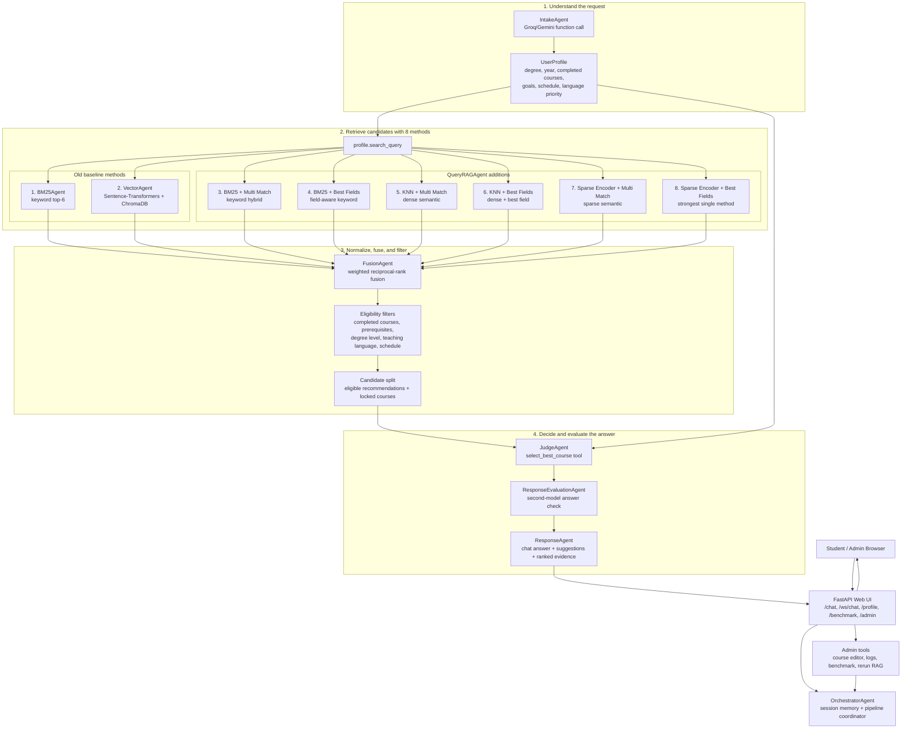
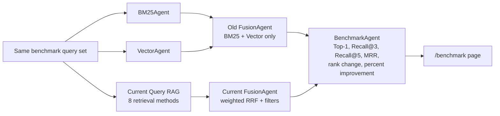

# Multi-Agent Course Finder v2 — NCU CSIE Midterm

### BM25 + Sentence-Transformers + Groq / Gemini Function Calling + FastAPI Web UI

---

## What's New in v2

| Feature                     | v1                       | v2                                                                          |
| --------------------------- | ------------------------ | --------------------------------------------------------------------------- |
| User input parsing          | Simple string validation | **IntakeAgent** — LLM function call extracts structured `UserProfile`       |
| Final answer                | Full ranked list         | **JudgeAgent** — LLM function call picks single best course with reasoning  |
| Query used for retrieval    | Raw user string          | Synthesised `search_query` from profile                                     |
| Output                      | Ranked list only         | Ranked list + judge verdict + confidence level                              |
| LLM backend                 | Ollama (local)           | **Groq** (`llama-3.3-70b-versatile`) or **Gemini** (`gemini-2.5-flash`)     |
| Student support             | Undergrad only           | **Undergrad + Master's + PhD** via `academic_year` mapping                  |
| Embeddings                  | Ollama Llama3            | **Sentence-Transformers** (`all-MiniLM-L6-v2`)                              |
| Session memory              | Stateless (single turn)  | **Multi-turn** — `UserProfile.update()` merges follow-up input across turns |
| Course catalogue            | 3 undergrad courses      | **70 courses** across CSIE, EE, Communication Engineering, and supporting Math |
| Off-topic guard             | None                     | Keyword-based guard on first message only                                   |
| Prerequisites               | Not checked              | Hard filter — locked courses shown with "complete first" chain              |
| Clarification               | None                     | Agent asks user to clarify ambiguous course names                           |
| **Web Interface**           | —                        | **FastAPI backend + HTML/JS frontend** with user chatbot and admin panel    |
| **Admin Features**          | —                        | Add/edit courses, view logs, manage course catalogue                        |
| **Language Support**        | —                        | Course language filtering (English/Chinese)                                 |
| **Degree Filtering**        | —                        | Degree level constraints (undergrad/master/PhD)                             |
| **Interactive Suggestions** | —                        | Suggestions when no eligible courses found                                  |

---

## Architecture

The system has three main lanes:

- **User lane**: real-time chat, profile memory, course recommendation.
- **Admin lane**: course CRUD, logs, benchmark view, and rerun controls.
- **Retrieval lane**: old BM25/vector retrieval plus six new Query RAG methods, fused into one normalized ranking.



### Retrieval Comparison Flow



### Benchmark Special Cases

The public `/benchmark` page compares the old retrieval baseline against the current Query RAG pipeline:

- **Old version**: `BM25Agent + VectorAgent` fused by `FusionAgent`.
- **Current version**: 8 retrieval methods fused with weighted RRF.
- **Metrics**: Top-1, Recall@3, Recall@5, MRR, rank change, percentage-point change, and relative percentage change.

Current benchmark set:

| Metric | Old FusionAgent | Current Query RAG | Change |
| --- | ---: | ---: | ---: |
| Top-1 | 70% | 80% | +10.0 pp |
| Recall@3 | 90% | 100% | +10.0 pp |
| Recall@5 | 100% | 100% | 0.0 pp |
| MRR | 0.792 | 0.883 | +9.1 pp |

The benchmark includes 10 fixed advising cases: 3 improved, 7 stayed the same, and 0 regressed. Two intentionally ambiguous course-name cases make the old-vs-current difference easier to see:

| Special Case | Expected Course | Old Rank | Current Rank | Difference |
| --- | --- | ---: | ---: | ---: |
| Computer Networks | `CSIE3003` | #3 | #1 | +2 ranks |
| Communication Systems | `EE3004` | #3 | #2 | +1 rank |

---

## Agents

| #   | Agent                 | Role                                                                                | LLM call?                      |
| --- | --------------------- | ----------------------------------------------------------------------------------- | ------------------------------ |
| 1   | **IntakeAgent**       | Extracts / updates structured `UserProfile` from free text                          | ✅ `extract_user_profile` tool |
| 2   | **BM25Agent**         | Keyword retrieval with BM25Okapi (top-6)                                            | —                              |
| 3   | **VectorAgent**       | Semantic retrieval with Sentence-Transformers + ChromaDB                            | —                              |
| 4   | **QueryRAGAgent**     | Expands retrieval to 8 ways: BM25, vector, BM25 MQ/BF, KNN MQ/BF, sparse MQ/BF      | —                              |
| 5   | **FusionAgent**       | Weighted RRF over all 8 retrieval ways + prerequisite gate + degree/language filters| —                              |
| 6   | **JudgeAgent**        | Picks single best course with reasoning, hallucination guard                        | ✅ `select_best_course` tool   |
| 7   | **ResponseAgent**     | Formats eligible list, locked list, and judge verdict + suggestions when no courses | —                              |
| 8   | **OrchestratorAgent** | Coordinates all agents, handles user/admin modes                                    | —                              |

---

### Query RAG Retrieval

The full pipeline now fuses 8 retrieval ways: the original `BM25Agent` and `VectorAgent`, plus six query-time strategies from `QueryRAGAgent`:

| Strategy | Use |
| --- | --- |
| BM25Agent | keyword retrieval |
| VectorAgent | Sentence-Transformers + ChromaDB |
| BM25 + Multi Match (MQ) | keyword hybrid |
| BM25 + Best Fields (BF) | keyword + field aware |
| KNN + Multi Match | dense semantic |
| KNN + Best Fields | dense semantic + best field |
| Sparse Encoder + Multi Match | sparse semantic |
| Sparse Encoder + Best Fields | strongest method |

---

## Web Interface

The application includes a modern web UI built with FastAPI backend and vanilla HTML/JS frontend.

### User Mode

- **Chatbot Interface**: Conversational course recommendations
- **Profile Sidebar**: Auto-updating user profile display
- **Minimal Responses**: Concise recommendations for users
- **Interactive Suggestions**: Helpful prompts when no courses are found

### Admin Mode

- **Login**: Password-protected access (default: admin123)
- **Course Management**: Add/edit courses with validation
- **Course Listing**: View all courses in the catalogue
- **Log Viewer**: Inspect full conversation logs and backend details

---

## Graduate Student Support

Academic year encodes both undergrad and graduate programmes — `degree_level` is derived automatically via `degree_from_year()`, no separate field needed:

| Degree Level  | `degree_level` | `academic_year` range |
| ------------- | -------------- | --------------------- |
| Undergraduate | `"undergrad"`  | 1 – 4                 |
| Master's      | `"master"`     | 5 – 6                 |
| PhD           | `"phd"`        | 7 – 10                |

The LLM maps natural language to the correct year:

| Input phrase                    | → `academic_year` |
| ------------------------------- | ----------------- |
| `"freshman"` / no hint          | 1                 |
| `"Master's"` / `"grad student"` | 5                 |
| `"2nd year Master's"`           | 6                 |
| `"PhD"` / `"doctoral"`          | 7                 |
| `"3rd year PhD"`                | 9                 |

---

## Course Catalogue

| ID       | Name                        | Dept | Prerequisites      | Language | Degree |
| -------- | --------------------------- | ---- | ------------------ | -------- | ------ |
| CSIE1001 | Introduction to Programming | CSIE | —                  | —        | —      |
| CSIE1002 | Discrete Mathematics        | CSIE | —                  | —        | —      |
| CSIE2001 | Data Structures             | CSIE | CSIE1001           | —        | —      |
| CSIE2002 | Computer Organization       | CSIE | CSIE1001           | —        | —      |
| CSIE3001 | Algorithms                  | CSIE | CSIE2001, CSIE1002 | —        | —      |
| CSIE3002 | Operating Systems           | CSIE | CSIE2001, CSIE2002 | —        | —      |
| CSIE4001 | Machine Learning            | CSIE | CSIE3001, MATH2001 | —        | —      |
| CSIE4002 | Deep Learning               | CSIE | CSIE4001           | —        | —      |
| CSIE4003 | Natural Language Processing | CSIE | CSIE4001, MATH2002 | English  | —      |
| CSIE4004 | Computer Vision             | CSIE | CSIE4001           | English  | —      |
| CSIE6001 | Research Methods in CS      | CSIE | —                  | English  | master |
| MATH2001 | Linear Algebra              | Math | —                  | —        | —      |
| MATH2002 | Probability and Statistics  | Math | —                  | —        | —      |

---

## Prerequisite Gate

`FusionAgent` splits all retrieved courses into two groups before passing to `JudgeAgent`:

- **Eligible** — all prerequisites met ✅ + degree level compatible + language matches → passed to JudgeAgent
- **Locked** — one or more prerequisites missing 🔒 or degree too high or language mismatch → shown in output with reason, never recommended

---

## Multi-Turn Profile Updates

`UserProfile.update()` merges follow-up input without overwriting prior information:

- **Lists** (`completed_courses`, `goals`, `constraints`) — appended and deduplicated
- **Scalar fields** (`degree_level`, `academic_year`, `search_query`) — only overwritten on explicit change
- **LLM failure on update** — existing profile returned unchanged

---

## Setup

### 1. Clone the repo

```bash
git clone <repo-url>
cd multiAgent-ncu-courses
```

### 2. Create and activate a virtual environment

```bash
# macOS / Linux
python3 -m venv venv
source venv/bin/activate

# Windows (Command Prompt)
python -m venv venv
venv\Scripts\activate.bat

# Windows (PowerShell)
python -m venv venv
venv\Scripts\Activate.ps1

# Another
python -m venv venv
./venv/Scripts/Activate
```

### 3. Install dependencies

```bash
pip install -r requirements.txt
```

### 4. Configure environment variables

Copy the example file and fill in your API keys:

```bash
cp .env.example .env
```

Then edit `.env`:

```
GROQ_API_KEY=your_groq_key_here
GEMINI_API_KEY=your_gemini_key_here
ADMIN_PASSWORD=choose_a_strong_admin_password
ADMIN_BYPASS_ENABLED=false
ENABLE_TRANSFORMER_EMBEDDINGS=false
```

Get your keys at:

- Groq → [console.groq.com](https://console.groq.com)
- Gemini → [aistudio.google.com](https://aistudio.google.com)

> `GEMINI_API_KEY` is only required if using `--provider gemini`.

---

## Running

### Web Interface (Recommended)

```bash
# Start the FastAPI server
uvicorn api:app --host 127.0.0.1 --port 8010

# Open browser to http://127.0.0.1:8010
# Admin login: use ADMIN_PASSWORD
```

For local classroom demos only, set `ADMIN_BYPASS_ENABLED=true` to let Admin Mode open without a password. Keep it `false` for deployed/public environments.

`ENABLE_TRANSFORMER_EMBEDDINGS=false` keeps deployment lightweight and uses the built-in TF-IDF semantic fallback. Set it to `true` only on hosts with enough memory/disk and install `sentence-transformers`.

### Deployment

This repo includes deployment files for common hosts:

- `Dockerfile` for Docker, Fly.io, Railway, VPS, and other container hosts.
- `render.yaml` for Render Blueprint deployments.
- `Procfile` for platforms that use a web process command.

Required production environment variables:

```
GROQ_API_KEY=your_groq_key_here
GEMINI_API_KEY=your_gemini_key_here
ADMIN_PASSWORD=choose_a_strong_admin_password
ADMIN_BYPASS_ENABLED=false
ENABLE_TRANSFORMER_EMBEDDINGS=false
```

Render deployment:

1. Push this repo to GitHub.
2. In Render, choose **New > Blueprint** and select this repository.
3. Set `GROQ_API_KEY`, `GEMINI_API_KEY`, and `ADMIN_PASSWORD`.
4. Confirm `ADMIN_BYPASS_ENABLED=false`.
5. Deploy the web service.

### Command Line Interface

```bash
# Interactive REPL — Groq (default)
python main.py

# Interactive REPL — Gemini
python main.py --provider gemini

# Single query
python main.py -q "I just started university, no programming experience"
python main.py --provider gemini -q "I finished ML, should I go into vision or language?"

# Specific model
python main.py --provider gemini --model gemini-1.5-pro

# Show current provider/model mid-session
You: model
```

---

## Example Output

```
═════════════════════════════════════════════════════════════════
  NCU Course Finder v2 — Personalized Recommendation
═════════════════════════════════════════════════════════════════

  STUDENT PROFILE
─────────────────────────────────────────────────────────────────
Degree     : Undergraduate
Year       : 3
Completed  : CSIE1001, CSIE1002, CSIE2001, CSIE3001, MATH2001
Goals      : machine learning
Constraints: none
Query      : machine learning AI algorithms advanced

  ✅  TOP RECOMMENDATION
─────────────────────────────────────────────────────────────────
  Course      : [CSIE4001] Machine Learning
  Instructor  : Prof. Tsai Mei-Ling
  Semester    : Fall / Spring
  Schedule    : Tuesday 14:00–17:00
  Credits     : 3
  Prereqs     : CSIE3001, MATH2001
  Confidence  : HIGH  ★★★

  Why this course?
    All prerequisites are met. You have already completed
    Algorithms and Linear Algebra, making CSIE4001 the
    natural next step toward your machine learning goals.

  🥈 Runner-up  : [CSIE4003] Natural Language Processing

  📋 ALL ELIGIBLE COURSES  (3 found)
─────────────────────────────────────────────────────────────────
  #1  [CSIE4001] Machine Learning           RRF=0.03226  ◄ recommended
  #2  [MATH2002] Probability and Statistics  RRF=0.01639
  #3  [CSIE1002] Discrete Mathematics       RRF=0.01266

  🔒 LOCKED COURSES  (prerequisites not yet met)
─────────────────────────────────────────────────────────────────
  ✗  [CSIE4002] Deep Learning
       Complete first: CSIE4001 (Machine Learning)
  ✗  [CSIE4003] Natural Language Processing
       Complete first: CSIE4001 (Machine Learning), MATH2002 (Probability and Statistics)
═════════════════════════════════════════════════════════════════
```

---

## Example Multi-Turn Session

### Web Interface

- Visit http://localhost:8000 for user mode
- Visit http://localhost:8000/admin for admin mode (login: admin123)

### CLI Example

```
You: What's the best restaurant near NCU?
→ Off-topic rejected. No course output.

You: Sorry, I just started university with zero programming experience.
→ [Degree: Undergrad | Year: 1 | Recommended: CSIE1001]

You: I finished intro programming. What's next?
→ [Completed: CSIE1001 | Recommended: CSIE2001]

You: I also completed discrete math and data structures.
→ [Completed: CSIE1001, CSIE1002, CSIE2001 | CSIE3001 now eligible]

You: I only have time on Tuesdays and Thursdays.
→ [Constraint added | Schedule filter applied to recommendation]

You: I finished ML. Should I go into vision or language?
→ [Both CSIE4003 and CSIE4004 eligible | Judge reasons between them]

You: I want courses in French.
→ No eligible courses found. Suggestions provided for better queries.
```

---

## Interactive Suggestions

When no eligible courses are found based on the user's profile and constraints, the system provides helpful suggestions to guide the user toward better queries:

- Academic interests (e.g., "I want to learn machine learning")
- Completed courses (e.g., "I've finished CSIE1001")
- Scheduling preferences (e.g., "Only mornings")
- Language preferences (e.g., "English courses")

This enhances user engagement and makes the chatbot more conversational.

---

## Tests

```bash
pytest test_demo_scenarios.py -v

# Single test
pytest test_demo_scenarios.py::test_04_prerequisites_fully_met -vv
```

10 demo scenarios covering: complete beginner, off-topic rejection, prerequisites not met, prerequisites fully met, multi-turn memory, schedule constraints, Judge over RRF, all courses locked, math-track student, and senior specialization.

---

## Files

```
multiAgent-ncu-courses/
├── api.py                        # FastAPI web server
├── main.py                       # CLI entry point — REPL + CLI
├── static/
│   ├── index.html                # User mode UI
│   └── admin.html                # Admin mode UI
├── agents/
│   ├── OrchestratorAgent.py      # Wires all agents together
│   ├── IntakeAgent.py            # Agent 1 — profile extraction
│   ├── BM25.py                   # Agent 2 — keyword retrieval
│   ├── VectorAgent.py            # Agent 3 — semantic retrieval
│   ├── QueryRAGAgent.py          # Agent 4 — 8-way query RAG retrieval
│   ├── FusionAgent.py            # Agent 5 — RRF + filters
│   ├── JudgeAgent.py             # Agent 6 — best course selection
│   └── ResponseAgent.py          # Agent 7 — output formatting
├── models/
│   ├── Course.py
│   ├── UserProfile.py            # Profile + update() + degree_from_year()
│   ├── RetrievalResult.py
│   └── JudgeVerdict.py
├── function/
│   └── main.py                   # call_groq_with_tools, call_gemini_with_tools
├── keywords/
│   ├── CourseKeywords.py         # Off-topic guard keyword set
│   └── OffTopicResponse.py
├── config/
│   └── main.py                   # Model + provider defaults
├── test_course_finder.py         # Additional tests
├── test_demo_scenarios.py        # 10 demo test cases
├── .env.example                  # API key template (safe to commit)
├── .env                          # Your actual keys (never commit)
├── .gitignore
├── requirements.txt
└── README.md
```

---

## .env.example

```bash
# Groq API key — required (default provider)
# Get yours at https://console.groq.com
GROQ_API_KEY=your_groq_key_here

# Gemini API key — only required if using --provider gemini
# Get yours at https://aistudio.google.com
GEMINI_API_KEY=your_gemini_key_here
```

---

## .gitignore

Make sure `.env` is never committed:

```
venv/
.env
__pycache__/
*.pyc
.chromadb/
```

---

## Requirements

```
groq
google-genai
rank-bm25
chromadb
sentence-transformers
python-dotenv
pytest
```
